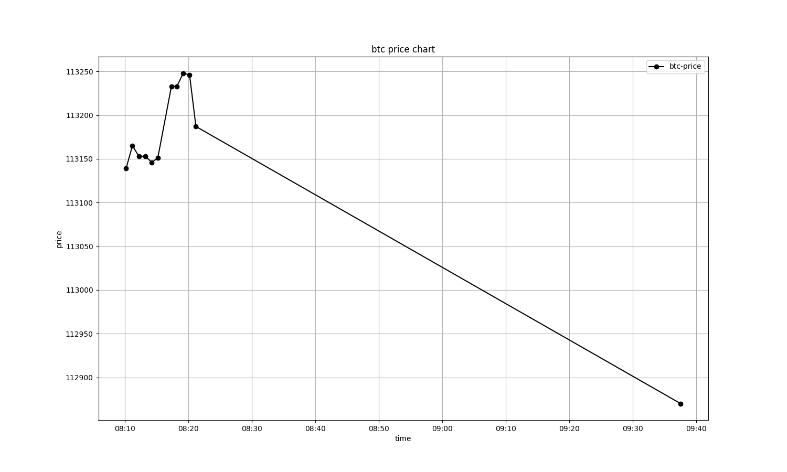

# 🧨 btcTracker 
In this project, we use **aiohttp** and **FastAPI** to fetch Bitcoin prices every minute.  
If the price increases by **more than 3% compared to 5 minutes ago**, a message is sent on **Telegram** using the **Telethon** library.  

Additionally, while the program is running, you can execute `chart.py` to view a **price change chart** for the last 30 minutes using **matplotlib**.
### 📌 Before running the project, make sure you've run the tor proxy on 9052 port on your system

## Setup

```bash
python -m venv venv
```

```bash
source venv/bin/activate
```

```bash
pip install -r requirements.txt
```

```bash
nano .env
```
then put your information on it

finally :
```bash
fastapi dev main.py
``` 

you can run `chart.py` to show the price-change-chart for the last 30 minutes



author : mohammad1973
